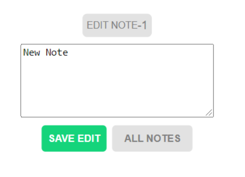

# Instrictions

The first thing that happens on the site is a prompt to access your location. Click 'yes' to view the weather details of your city. Otherwise, click 'cancel' to continue. This prompt comes up only once no matter your choice. 

The next is the screen where the weather forecast for the 15 largest cities is listed in alphabetical order. This is the table that will be populated with the cities you search for.

Clicking on an entry in the cities column seen above( like Beijing ), will bring you to the details page of the selected city's forecast seen below.

In the above details page, one can add notes by filling in the input and pressing the 'Add Note' button seen in the Notes section below.

The note will be available beneath the Add Note section seen below.

With the buttons seen below, one can edit or delete saved notes. The left button is for editing, the right for deleting.

The delete button will remove the note instantly, while the edit button will bring you to the screen below. Press the "Save Edit" button when your done editing to store your edited note in the local storage. 

In the list of all Cities seen in image 2. The buttons below will add Favourites and delete forecast entries. The left button will add favourites, the right will delete forecasts.

The favourites section can be viewed by pressing this button below.

The favourite forecasts will then come up, seen below. Here you can also view the details of the city by clicking the city name. Clicking the star icons seen below will remove the particular favourite entry from the list. The all cities label seen below is also clickable and will bring you to the 'All Cities' table.

In the favourites section and the 'all cities' section, you can start a new search by clicking the 'Search new cities' link seen below.

This will bring you to the search screen below. Fill in the input with a city name then press the 'search' button seen below. This will add the city to the 'all cities' list.

