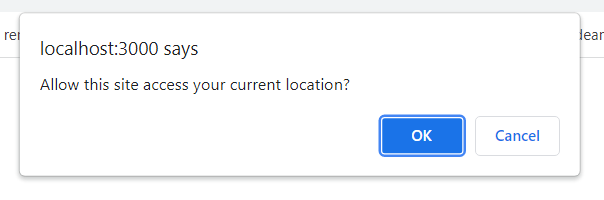
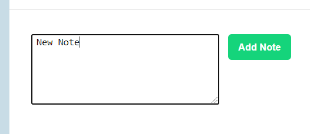

# Instrictions

The first thing that happens on the site is a prompt to access location. Click 'yes' to view the weather details of your city. Otherwise, click cancel to continue. This prompt comes up only once no matter your choice. 

The next is the screen where the weather forecast for the 15 largest cities is listed in alphabetical order.

Clicking on an entry in the cities column seen above( like Beijing ), will bring you to the details page of the selected city's forecast seen below.

In the above details page, one can add notes by filling in the input and pressing the 'Add Note' button seen in the Notes section below.

With the buttons seen below, one can edit or delete saved notes. The left button is for editing, the right for deleting.

The delete button will remove the note instantly, while the edit button will bring you to the screen below. Press the "Save Edit" button when your done editing to store your edited note in the local storage. 

